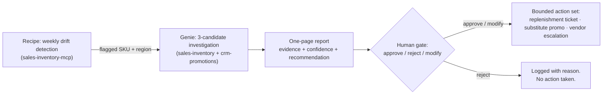

# PRD: Sell-Through Drift Monitor (IDEA Lifestyle)

**Resources:** Demo runbook — `wow2026-sell-through-drift-runbook.md` (this folder). No PMO ticket — fictional in-demo artifact, written live on stage during the Stage 3 investigation; canonical Workato PRD format.
**Author:** Store Operations / Analytics (drafted by Claude during the live investigation)
**Last Updated:** 2026-09-10

## Executive Summary

IDEA Lifestyle runs weekly sell-through reporting at the regional level. On 2026-09-10, a manual investigation into a 40% sell-through drop on BRH-2240 (Branchwood 3-Cube Modular Shelf) in Texas found a failure mode no dashboard caught: the reorder point fired correctly in 8 stores, the vendor (Branchwood) delayed both purchase orders by five weeks, and nothing in the business watches for that divergence between "replenishment ordered" and "replenishment delivered."

This PRD specifies the system that watches for it: a scheduled Recipe that detects sell-through drift, a Genie that investigates each flagged SKU against a bounded set of candidate causes, a one-page report with a recommended action, and exactly one human decision before anything executes.

- **Detection is automated; decisions are not.** Every recommended action passes a mandatory approve / reject / modify gate.
- **The candidate set is bounded.** Pricing/promotion, demand shift, and supply/stock-out — checked in fixed order. A drift that matches none of the three is reported as unclassified and is explicitly out of scope.
- **The action set is bounded to primitives that exist today.** Replenishment escalation ticket, substitute promotion proposal, vendor escalation — nothing novel is introduced at execution time.
- **This is intentionally a monitor, not an auto-replenisher.** Low stock already triggers reorder correctly; the gap is vendor non-delivery after a correct reorder.

## Product Vision

Every significant sell-through drift at IDEA Lifestyle is detected, explained against known cause patterns, and put in front of a human with a recommended action — within one weekly cycle, without an analyst spending half a day per SKU.

## Target Users

**Store Operations Analyst.** Today: spots anomalies by eyeballing regional dashboards, then spends hours pulling inventory, promotion, and PO data to find a cause. With this PRD: receives a one-page report with evidence and a recommendation, and makes the call.

**Regional Inventory Manager.** Today: learns about regional drift from the analyst's ad-hoc emails, after stores have been empty for weeks. With this PRD: is the decision-maker on the human gate — approves, rejects, or modifies each recommended action.

**Replenishment Planner (Procurement Liaison).** Today: finds out about vendor non-delivery when a store escalates. With this PRD: vendor-delay evidence arrives attached to a recommended escalation, with PO numbers and slip durations already pulled.

## Problem Statement

1. **Regional aggregates hide store-level failure.** Texas sell-through fell 39.7% on BRH-2240, but the entire drop was 8 of 40 stores — a weekly regional dashboard reads it as noise until it's a quarter old.
2. **Nobody watches the gap between reorder and delivery.** The reorder point fired correctly in all 8 affected stores; both Branchwood POs slipped 2026-08-14 → 2026-09-18, and no system or person owns detecting that divergence.
3. **Cause-finding is manual and cross-system.** Ruling pricing/promotion out and vendor delay in required pulling data from two disconnected systems plus a product catalog — hours of analyst time per SKU.
4. **The corrective action exists but never fires fast enough.** Merchandising rules already designate IDH-3310 as the preferred substitute, in stock in all affected stores — nothing connects that rule to the stock-out event in time to matter.

## Solution Overview

Core philosophy: **automate the investigation, not the judgment.** The system does everything an analyst did manually on 2026-09-10 — detect, localize, rule causes in and out, recommend — and stops at a human decision point. One human approval gates all downstream action.

### Flow 0: Weekly drift detection

A scheduled Recipe sweeps sell-through by SKU and region each week. A SKU/region pair is flagged when it meets the drift condition: at least one store at or below safety stock for 3+ consecutive weeks **and** a regional sell-through decline of 15%+ over the trailing 6 weeks. Thresholds are configuration, not code. Each flagged pair is handed to the Drift Investigator Genie.

### Flow 1: Bounded automated investigation

The Genie checks three candidate causes in fixed order, using the two existing data sources: (1) **pricing/promotion** — promotion windows and price history via crm-promotions-mcp; (2) **demand shift** — regional sell-through shape vs. other regions, store-level uniformity via sales-inventory-mcp; (3) **supply/stock-out** — inventory positions, backorder cases, purchase-order delays via sales-inventory-mcp. The output is a one-page report: drift condition, evidence per candidate, confidence, recommended action. On 2026-09-10 this flow, run manually, landed on supply/stock-out in 8 tool calls.

### Flow 2: Human decision and downstream action

The Recipe waits on the Regional Inventory Manager's decision. On approve or modify, it resumes and the Genie executes from the bounded action set: create replenishment escalation ticket, propose substitute promotion, notify vendor manager. On reject, the report is logged with the rejection reason and nothing executes. The decision and its reason are recorded either way — that log is what makes the system auditable and improvable.

## Open Questions

1. **Should detection thresholds vary by product category?** `OPEN` — current thinking: ship with global thresholds (3 weeks / 15%), tune per category after the first month of false positives.
2. **Does a drift that matches none of the three candidates get investigated anyway?** `RESOLVED` — no. Reported as unclassified, no recommendation, no action. The candidate set is intentionally bounded; expanding it is a separate PRD.
3. **Does the Genie ever execute without the human gate?** `RESOLVED` — never. Exactly one mandatory human decision point. This is intentional.

## Assumptions

1. Sales-inventory and CRM/promotions data sources remain reachable by the Recipe and Genie with current credentials. **Low risk** — both are already MCP-connected.
2. Merchandising substitution rules (e.g., IDH-3310 for BRH-2240) stay current in the product catalog. **Medium risk** — stale substitution data would produce stale recommendations; flagged for the report's confidence line.
3. Regional Inventory Managers can respond to the decision gate within one business day. **Low risk** — response latency affects action speed, not correctness.

## Feature Requirements

### F1: Weekly drift detection

**Priority:** P0 (Must Have)

**Description:** A scheduled Recipe sweeps sell-through weekly and flags SKU/region pairs that meet the drift condition, with thresholds held in configuration.

**Functional Requirements:**

1. Runs on a weekly schedule against sell-through data from sales-inventory-mcp.
2. Flags a SKU/region pair when any store in the region has been at or below safety stock for 3+ consecutive weeks AND regional sell-through declined 15%+ over the trailing 6 weeks.
   - Both thresholds (weeks, decline %) are configurable without editing the Recipe.
3. Each flagged pair is passed to the Drift Investigator Genie with SKU, region, and the flagging evidence.

**Acceptance Criteria:**

- [ ] A SKU/region matching the BRH-2240/Texas seed pattern (8 stores, 5 weeks below safety, −39.7%) is flagged.
- [ ] A healthy SKU/region (no stores below safety, flat sell-through) is not flagged.
- [ ] Changing the decline threshold in configuration changes which pairs are flagged without any code change.

### F2: Bounded candidate-cause investigation

**Priority:** P0 (Must Have)

**Description:** The Drift Investigator Genie checks each flagged pair against the three candidate causes in fixed order and produces evidence for or against each.

**Functional Requirements:**

1. Checks pricing/promotion first (promotion windows, price history), then demand shift (regional comparison, store-level uniformity), then supply/stock-out (inventory positions, backorder cases, PO delays).
2. Uses only the two existing data sources: sales-inventory-mcp and crm-promotions-mcp.
3. A pair matching no candidate is classified "unclassified — out of scope" and carries no recommended action.

**Acceptance Criteria:**

- [ ] Vendor-delay scenario: investigation lands on supply/stock-out and cites backorder reason codes and delayed POs.
- [ ] Demand-surge scenario (promotion active, sell-through up): investigation lands on demand and explicitly clears pricing and supply.
- [ ] Inventory-mismatch scenario (low stock, POs on time): investigation lands on supply with mismatch noted, or returns unclassified.
- [ ] Clean scenario: investigation reports no drift and produces no recommendation.

### F3: One-page drift report

**Priority:** P0 (Must Have)

**Description:** Every investigated pair produces a single-page report an inventory manager can read in under two minutes.

**Functional Requirements:**

1. Contains: drift condition (metric, window, magnitude), evidence per candidate cause, confidence, recommended action from the bounded set.
2. Cites the underlying records: store IDs, PO numbers, backorder case references, substitute SKU per catalog rules.
3. Fits on one page; no appendices.

**Acceptance Criteria:**

- [ ] The report for the BRH-2240/Texas case names the 8 stores, both PO numbers, the Branchwood delay reason, and substitute IDH-3310.
- [ ] Confidence reflects evidence strength; a single-candidate-clear case reads higher than a multi-candidate case.

### F4: Human decision gate

**Priority:** P0 (Must Have)

**Description:** Exactly one mandatory human decision — approve, reject, or modify — gates every recommended action. The Recipe waits; the decision and reason are recorded.

**Functional Requirements:**

1. The Recipe pauses on a wait step until the Regional Inventory Manager submits a decision on the report.
2. Three branches: approve (execute as recommended), reject (log with reason, no action), modify (execute the modified action).
3. Every decision is recorded with timestamp, decider, branch, and free-text reason.

**Acceptance Criteria:**

- [ ] No downstream action executes before a decision is submitted.
- [ ] Reject produces no action and a complete log entry including the rejection reason.
- [ ] Modify executes the modified action, not the original recommendation.

### F5: Bounded downstream action set

**Priority:** P1 (Should Have)

**Description:** On approval, the Genie executes actions drawn exclusively from primitives that exist in the business today.

**Functional Requirements:**

1. Supported actions: create replenishment escalation ticket, propose substitute promotion (per catalog substitution rules), notify vendor manager with delay evidence.
2. No other action types are permitted; anything else is out of scope by design.
3. Executed actions are logged and linked back to the report and decision.

**Acceptance Criteria:**

- [ ] Approved BRH-2240/Texas case produces a replenishment escalation and a substitute-promotion proposal referencing IDH-3310.
- [ ] Executed actions trace back to the specific report and human decision that authorized them.

## Exit Criteria

**Core Functionality**

- [ ] Recipe flags the seeded BRH-2240/Texas drift on a live run.
- [ ] Genie produces a one-page report landing on supply/stock-out with a substitute-promotion recommendation.
- [ ] Human gate pauses execution until a decision; approve, reject, and modify branches each behave per F4.
- [ ] Approved actions execute from the bounded set only.

**Demo flow (end to end):**

1. Run the Recipe against the BRH-2240/Texas seed data.
2. Show the flagged drift and the Genie's report — 8 stores, two delayed Branchwood POs, substitute IDH-3310.
3. Reject once, showing no action fires and the rejection is logged.
4. Approve, show the escalation and substitute-promotion proposal, tied to the decision.

**Documentation**

- [ ] Report format documented (this PRD, F3).
- [ ] Action set and its boundaries documented (this PRD, F5).

**Integration**

- [ ] Recipe and Genie operate against sales-inventory-mcp and crm-promotions-mcp with no manual data pulls.

## Non-Functional Requirements

- **Latency:** detection sweep completes within one weekly cycle; investigation per flagged pair completes in under 5 minutes.
- **Observability:** every flag, report, decision, and action is logged and queryable.
- **Security baseline:** human-gate decisions are attributable to a named user; no anonymous approvals.

## Out of Scope

1. Causes outside the three bounded candidates (returns spikes, competitive events, weather) — reported as unclassified, expansion is a separate PRD.
2. Auto-replenishment or any execution without the human gate — deliberately excluded; low stock already triggers reorder, and that is not the gap.
3. Vendor scorecarding or OTIF analytics — the vendor evidence feeds that conversation, but this system does not own it.
4. Multi-region or cross-SKU correlation — single SKU/region per investigation only.

## Success Metrics

**Leading (first 30 days):**

- 100% of flagged drifts receive a human decision within one business day.
- Report read-to-decision time under 5 minutes median.

**Lagging (90 days):**

- Mean time from drift onset to corrective action drops from ~5 weeks (the BRH-2240 baseline) to under 1 week.
- Zero unlogged downstream actions.
- Reject/modify rate between 10–40% — a gate that is always approved is decoration; a gate that is always rejected means the recommendations are wrong.

## Security Considerations

- Human-gate decisions are attributable: named decider, timestamp, reason. No anonymous or API-driven approvals.
- Data sources are read-only for the investigation; writes occur only in the bounded action set.
- Every action links to the report and decision that authorized it — the audit trail is the product, not a byproduct.

## Data Considerations

- Reads: sell-through, inventory positions, backorder cases, purchase orders, product catalog (sales-inventory-mcp); promotion windows and price history (crm-promotions-mcp).
- Writes: escalation tickets, promotion proposals, vendor notifications, and the decision/audit log.
- No PII. All records are store-, SKU-, and vendor-level, not person-level.

## Appendix: Customer Evidence

**IDEA Lifestyle — Store Operations (internal, the originating case).** BRH-2240 (Branchwood 3-Cube Modular Shelf), Texas. Raised by a store operations analyst on 2026-09-10. Sell-through down 39.7% over six weeks; root-caused live during the Stage 3 investigation to 8 stores stocked out for 5 consecutive weeks behind delayed Branchwood POs 78412/78455, with pricing/promotion ruled out and substitute IDH-3310 available in all affected stores. This case is the seed scenario for every acceptance criterion above — the system is specified to reproduce, automatically, what the analyst did by hand.
